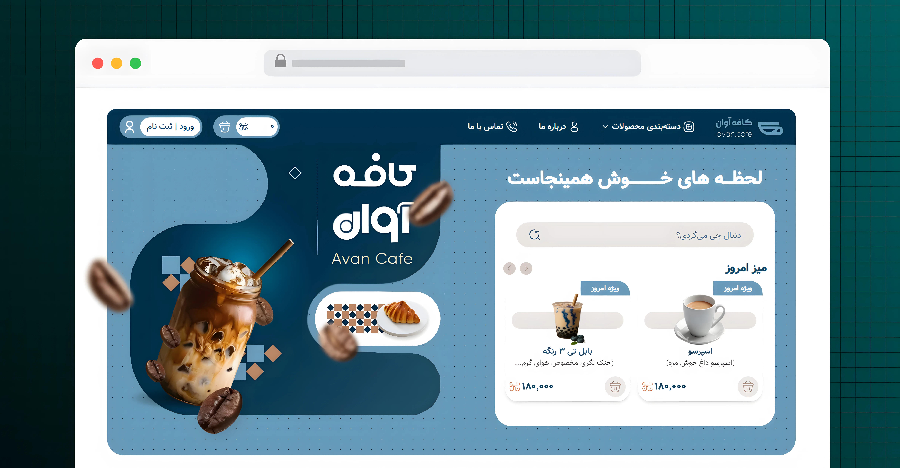

# 🎯 Landing Page - Avan Cafe
A beautiful web landing-page built with React and JavaScript with a
clean and responsive user interface.

------------------------------------------------------------------------

## 👀 Preview

<div align="center">
  
</div>

<div align="center">
  <span>
    🔗 Repo: 
    <a href="https://github.com/SabziDev/avan-cafe">LINK</a>
  </span>
  <span>
    🔗 Demo: 
    <a href="https://sabzidev-avancafe.vercel.app">LINK</a>
  </span>
</div>

------------------------------------------------------------------------

## ✨ Features

-   Product Slider
-   Custom Tailwind components
-   Fully responsive design

------------------------------------------------------------------------

## ⚙️ Technologies

-   Tailwind
-   React

------------------------------------------------------------------------

## 📂 Project Structure

``` text
src/
├── components/
├── hooks/
├── layouts/
├── pages/
├── routes.jsx
├── input.css
```

------------------------------------------------------------------------

## 🚀 Installation

Clone the repository:

``` bash
git clone https://github.com/SabziDev/avan-cafe.git
```

Go to the project folder:

``` bash
cd avan-cafe
```

Install dependencies:

``` bash
pnpm i
```

Run the project:

``` bash
pnpm dev
```

------------------------------------------------------------------------

## 📦 Dependencies

| Package | Description |
| :--- | :--- |
| Tailwind | --- |
| React | --- |
| Swiper | For slider |
| Framer-motion | For parallax effect |

------------------------------------------------------------------------

## 👨‍💻 Developer

Created by **ABOLFAZL SABZMOHAMMADI**

GitHub: [github.com/SabziDev](https://github.com/SabziDev)
<br />
Website: [SabziDev.com](https://SabziDev.com)
