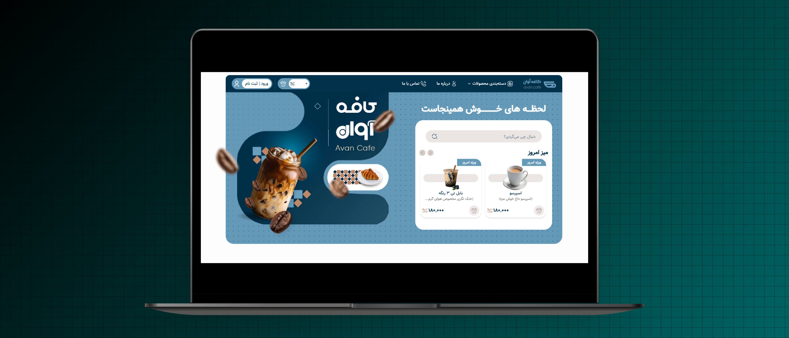

# Landing Page - Avan Cafe

A beautiful web landing-page built with React and JavaScript with a
clean and responsive user interface.

------------------------------------------------------------------------

## Preview



🔗 Repository: [GITHUB](https://github.com/SabziDev/visionui-dashboard)
<br />
🔗 Live Demo: [LIVE DEMO](https://sabzidev-avancafe.vercel.app)

------------------------------------------------------------------------

## Features

-   Product Slider
-   Custom Tailwind components
-   Fully responsive design

------------------------------------------------------------------------

## Technologies

-   Tailwind
-   React

------------------------------------------------------------------------

## Project Structure

``` text
src/
├── components/
├── hooks/
├── layouts/
├── pages/
├── routes.jsx
├── input.css
```

------------------------------------------------------------------------

## Installation

Clone the repository:

``` bash
git clone https://github.com/SabziDev/avan-cafe.git
```

Go to the project folder:

``` bash
cd avan-cafe
```

Install dependencies:

``` bash
pnpm i
```

Run the project:

``` bash
pnpm dev
```

------------------------------------------------------------------------

## Dependencies

  Package        Description
  -------------- -----------------
  PACKAGE NAME   PACKAGE PURPOSE

------------------------------------------------------------------------

## Developer

Created by **ABOLFAZL SABZMOHAMMADI**

GitHub: [MY GITHUB PROFILE](https://github.com/SabziDev)
<br />
Website: [MY GITHUB PROFILE](https://SabziDev.com)
